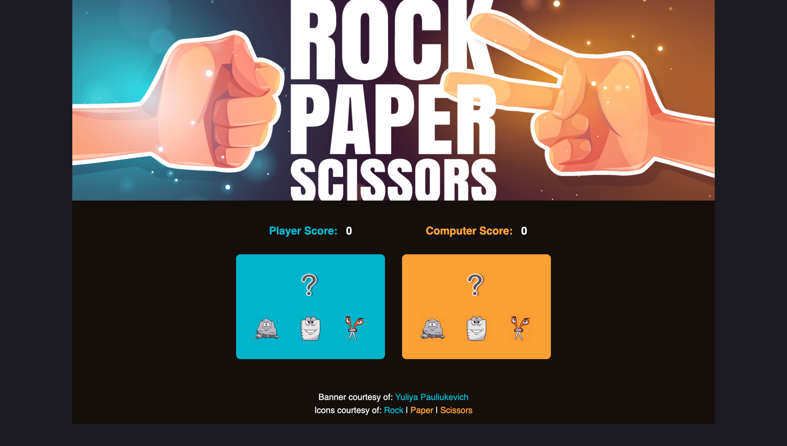
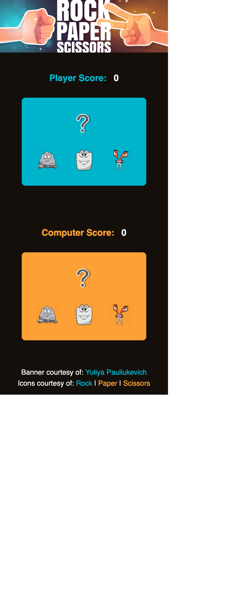

# The Odin Project - rock-paper-scissors project

## Table of contents

- [Overview](#overview)
  - [The challenge](#the-challenge)
  - [Screenshot](#screenshot)
  - [Links](#links)
- [My process](#my-process)
  - [Built with](#built-with)
  - [What I learned](#what-i-learned)
  - [Continued development](#continued-development)
  - [Proud of](#proud-of)
  - [Useful resources](#useful-resources)
- [Author](#author)

## Overview

### The goal 

The goal of the project was to implement the grade-school classic "rock paper scissors”. The first part of the project, was aimed at learning how to program the logic to make the basic game play work. The second part of the project was to lear how to manipulate the DOM to create a UI to enhance the game play experience. 

I went beyond the original project scope and used this project to practice all of my front end skills (HTML, CSS, and Javascript).

### Screenshot




### Links

- [Solution](https://github.com/ryanthayes/top-rock-paper-scissors)
- [Live URL](https://ryanthayes.github.io/top-rock-paper-scissors)

## My process

### Built with

- Semantic HTML5 markup
- CSS custom properties
- Flexbox
- Mobile-first workflow
- Javascript ES6

### What I learned

Everything! On a more serious note, this is the project where Javascript finally "clicked". It was my first real experience with manipulating the DOM using Javascript. This is what I was looking forward to when I began my Javascript journey. Learning the programming logic and syntax wasn't too exciting, but finally being able to control and manipulate the elements on a site in a practical project made it all come together.

I also learned to really embrace console.log() throughout teh development process to debug each step of the way. It really helps to be able to "see" what the computer sees when something isn't going as planned. 

### Continued development

I still need to work on where to begin with the logic of the program and breaking it down into smaller parts. I still have a bit of the "deer in the headlights" feeling when I begin a new project. I need to be able to do it without the guiding hand and prompts from The Odin Project.

### Proud of

One of the bits of code that I am proud of (and struggled to get to work) was replacing and existing image in the DOM based on the player and computer choices during each round of the game.

```
function updateChoices(playerSelection, computerSelection) {
    switch (playerSelection) {
      case 'rock':
        document.getElementById('player-choice').src = "/images/icon-rock.png"; // Replace existing img with new img
        break
      case 'paper':
        document.getElementById('player-choice').src = "/images/icon-paper.png";
        break
      case 'scissors':
        document.getElementById('player-choice').src = "/images/icon-scissors.png";
        break
    }
  
    switch (computerSelection) {
      case 'rock':
        document.getElementById('computer-choice').src = "/images/icon-rock.png";
        break
      case 'papers':
        document.getElementById('computer-choice').src = "/images/icon-paper.png";
        break
      case 'scissors':
        document.getElementById('computer-choice').src = "/images/icon-scissors.png";
        break
    }
  }

```

### Useful resources

[How to Build a Modal with JavaScript](https://www.freecodecamp.org/news/how-to-build-a-modal-with-javascript/) - One of the "finishing touches" I like about my final design is the Modal that pops up when the game ends. I like how it mimics a video game "end game" screen. I had never done before. This tutorial from freeCodeCamp was a great resource.

## Author

- Github - [@ryanthayes](https://github.com/ryanthayes)